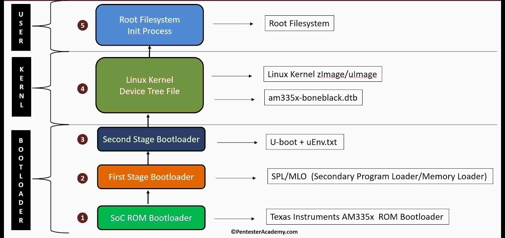
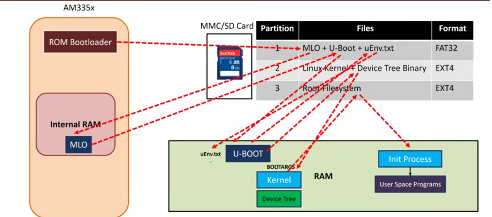
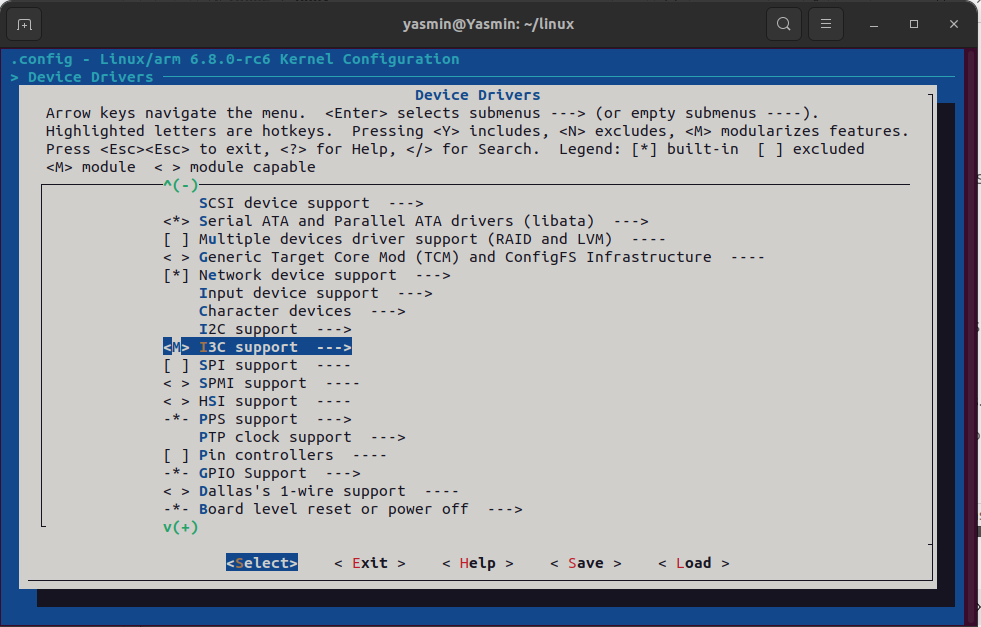
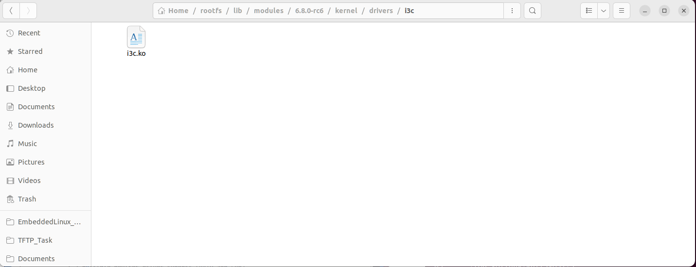
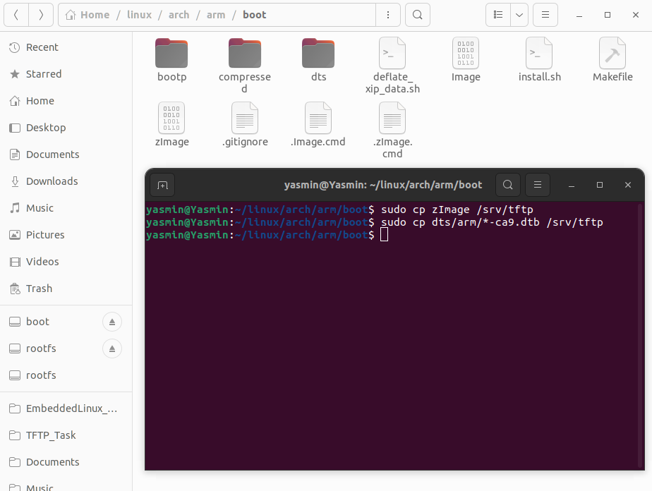
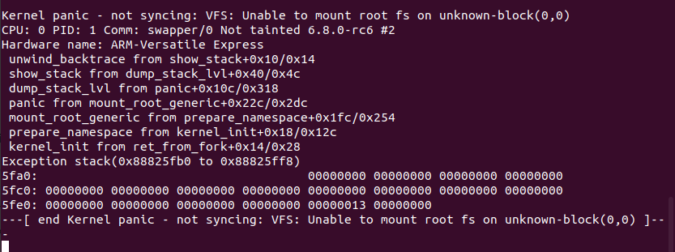

# Configuring Linux Kernel

First, let's go over the Beagle Bone Black Boot Process to refresh out memory.


## Beagle Bone Black Boot Process:







**Lets say that AM335x is our SOC. You have an external SD Card with FAT32 & EXT4 Partitions.** 

- The FAT32 Parition will contain the U-boot , uEnv.txt configuration file , Kernel & DTB file. 

- The EXT4 Parition will contain the Root Filesystem.

  

**The steps for the Boot Process will be as follows:**

1) ROM Bootloader will load MLO from SD Card to Internal RAM, and passes control to it.

   > Note: Passing control to it means that MLO will be erased from memory. 

2) MLO will copy U-Boot from SD-Card to External RAM

3) U-Boot will check if uEnv.txt is present, and will copy it from SD-Card to RAM.

4) U-boot will check where to load Kernel & DTB file from, using the uEnv.txt file, and will load them to External RAM
5) U-boot will pass control to Kernel.

5) Kernel will mount the root file system

6) Kernel will run the init process from file system in RAM

   

## Questions that may come to mind

#### 1) Why do we need the first stage boot loader (MLO), why don't we run the U-boot from Internal RAM?

RAM in SOC is very expensive, so its usually small in size.(About 128KB). U-boot size is never going to fit within the internal RAM of the SOC. 

#### 2) Why doesn't the ROM Boot loader load U-Boot directly into DRAM?

The ROM boot loader has no idea how to configure an external RAM. The MLO is the one who understands how this external RAM works. So it initializes the DRAM, then passes control to the secondary bootloader (U-boot) in DRAM.

#### 3) Difference between U-boot .dtb & Kernel .dtb files:

U-boot device tree  is used to configure and initialize the hardware components needed  during the boot process, while the Linux kernel used the device tree to  describe the hardware configuration once the kernel is booted.


## Kernel Configuration for Vexpress (Qemu)

1. export the compiler

   `export CROSS_COMPILE=PathToCompiler/arm-linux-cortexa9Compiler`

2. export the architecture used
   `export ARCH=arm` 

3. configure the kernel with the configurations below:

   `make menuconfig`

   > Enable **devtmpfs**
   >
   > Change kernel compression to **XZ**
   >
   > Change your kernel local version to your name and append on it -v1.0
   >
   > Choose I3C device driver to be compiled dynamically 

4. Build the kernel 

   `make -j4 zImage modules dtbs`
   
   

Note: devmpfs is a file system that is responsible for mounting the device notes in the /dev directory, without checking its box, you won't have any access to your module from the userspace.

### Choosing Device Driver to be Compiled Dynamically

In menuconfig -> Device Drivers, you can choose a module to be

- Static. Ex: I3C<*>
- Dynamic. Ex: I3C<M>

Here, we choose the I3C Module to be compiled dynamically.



The compiled modules have a .ko suffix and are generated  in the same directory as the source code, meaning that they are  scattered all around the kernel source tree.

To install them into the staging area of your root  filesystem, provide the path using **INSTALL_MOD_PATH**:

```
make -j4 ARCH=arm CROSS_COMPILE=arm-cortex_a9-linux-gnueabihf- INSTALL_MOD_PATH=$HOME/rootfs modules_install
```


We can see our compiled I3C module in the installed path we provided.




## Booting Kernel from TFTP

Repeating steps from the [TFTP Task](https://github.com/yasminehelmy2001/Embedded_Linux/tree/master/EmbeddedLinux/TFTP_Task):

1) Copy zImage & dtb files to TFTP Folder




2) Run qemu 

3) Set Host & Qemu IP Addresses 

4) Load Kernel & dtb files through tftp

   ```
   setenv zimg_add 60000000
   setenv dtb_add 65000000
   saveenv
   tftp $zimg_add zImage
   tftp $dtb_add vexpress-v2p-ca9.dtb
   ```

5. Make sure that the information is loaded into memory using:

   ```
   md $zimg_add
   md $dtb_add
   ```

Then you will set the `bootarg` environment variable

```
setenv bootargs console=ttyAMA0 
saveenv
```

> The "bootargs" variable contains command-line arguments passed to the Linux kernel during the boot process. This will direct the kernel messages to the serial port.

Finally, you will boot the kernel image with the dtb file using the `bootz` command:

The `bootz` command is used to boot a Linux kernel image along with its device tree blob (DTB) on an embedded board.

```
bootz $zimg_add - $dtb_add
```

You should face this error (or Panic):



This panic is caused because the kernel is unable to find a root file system to mount. This error will be solved in the next task, by using the help of BusyBox.