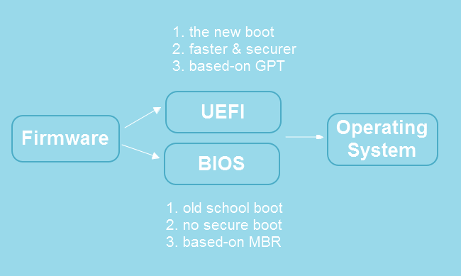
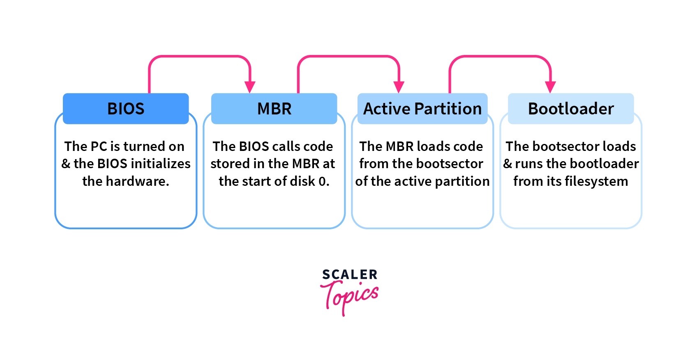
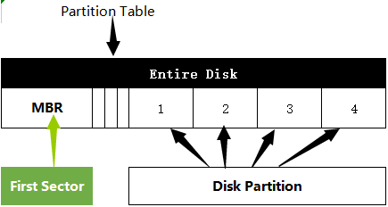

# 1. File Systems

A  **file system**  defines how files are  **named**,  **stored**, and  **retrieved**  from a storage device.

## 1.1 Partitioning

Partitioning is splitting a storage device into several  *logical regions*, so they can be managed separately as if they are separate storage devices. We usually do partitioning by a disk management tool provided by operating systems.

On a computer with multiple partitions, you can install several  operating systems, and every time choose a different operating system to boot up your system with.

When partitioning a storage device, we have two partitioning methods to choose from:

- **Master boot record (MBR) Scheme**
- **GUID Partition Table (GPT) Scheme**

The first few blocks on the storage device will always contain critical data about your partitions.

Hardware manufacturers make firmware based on two specifications:

- **Basic Input/Output (BIOS)**
- **Unified Extensible Firmware Interface (UEFI)**

UEFI-based firmware uses a GPT-partitioned storage device to handle the booting process. MBR partitioning scheme is a part of the BIOS specifications and is used by BIOS-based firmware.

When you press the power button on your computer, the firmware is the first program to run.

The mission of the firmware (among other things) is to boot up the  computer, run the operating system, and pass it the control of the whole system.

A firmware also runs pre-OS environments (with network  support), like recovery or diagnostic tools, or even a shell to run  text-based commands.

The first few screens you see before your  Windows logo appears are the output of your computer's firmware,  verifying the health of hardware components and the memory.

### 1.1.1 MBR Partitioning

MBR partitioning scheme is a part of the BIOS specifications and is used by BIOS-based firmware.

On MBR-partitioned disks, the first sector on the storage device contains essential data to boot up the system.

MBR contains the following information:

- The boot loader, which is a  **simple program**  (in machine code) to initiate the first stage of the booting process. The responsibility of the first-stage boot loader is to initiate the next (and more complicated) stages of the booting process.
- A  **partition table**, which contains information about your partitions.

The second stage boot loader, which is now capable of working with  files, can load the operating system's boot loader file to boot up the  respective operating system.

### 1.1.2 Dual BOOT

In each partition, you can divide it up to file systems, and you can include a boot loader for each patition as well.

> +----------------------------------------------------------------------------------+
> |                  Master Boot Record                                                |
> +----------------------------------------------------------------------------------+
> |             Boot Code (MBR Boot Loader)                                   |
> +----------------------------------------------------------------------------------+
> |              Partition Table (up to 4)                                             |
> |                                                                                                     |
> |   Partition 1 (Windows)    |   Partition 2 (Ubuntu)               |
> |   (Windows Boot Loader)    |   (GRUB Boot Loader)           | 
> |             ...             |           ...         |
> +----------------------------------------------------------------------------------+
> |                 MBR Signature (0x55AA)                                         |
> +----------------------------------------------------------------------------------+

Heres how the Dual Booting works:

1. **Partitioning**: Your single physical hard drive is divided into multiple partitions, each of which is treated as a separate disk space. For example, you might have one partition for Windows and another for Ubuntu.

2. **Installing Operating Systems**: Each partition can have its own operating system installed. During the installation process of each operating system, the respective bootloader (e.g., Windows Boot Manager for Windows, GRUB for Ubuntu) is installed into the boot sector of the partition.

3. **Booting Process**: When you start your computer, the BIOS loads the MBR from the physical hard drive. The MBR then loads the boot sector of the active partition. Each partition's boot sector contains code that loads the respective bootloader installed on that partition.

4. **Choosing Operating System**: When you start your computer, you'll typically see a bootloader menu (like GRUB) where you can choose which operating system you want to boot into. This menu is provided by the bootloader installed on the active partition.

5. **Switching between Operating Systems**: You can switch between operating systems by selecting the desired one from the bootloader menu. The bootloader then loads the necessary files from the respective partition to boot into the chosen operating system.

   

"MBR Boot Loader" in the diagram refers to the small piece of code stored in the Master Boot Record (MBR) itself. This code is responsible for locating and loading the active partition's boot sector, where the actual bootloader resides.

In a typical dual-boot scenario with Ubuntu and Windows:

- The MBR Boot Loader would typically be configured to load GRUB, the bootloader installed by Ubuntu, as the primary bootloader.
- GRUB, in turn, presents a menu during boot allowing you to choose between Ubuntu and Windows.
- If you select Windows from the GRUB menu, GRUB chainloads the Windows Boot Loader stored in the boot sector of the Windows partition.

## 1.2 Architecture of file systems

A file system installed on an operating system consists of three layers:

- **Physical file system**
- **Virtual file system**
- **Logical file system**

### 1.2.1 Physical File System

hysical file systems define how data is stored, organized, and managed on the storage device (such as a hard drive or SSD).

They control the low-level details of storing files, including disk partitioning, allocation of disk space, management of directories and file metadata, and handling of file access permissions.

Examples of physical file systems include NTFS, ext4, FAT32, and HFS+.

### 1.22 Virtual File System

The Virtual File System is an abstraction layer in an operating system that provides a consistent interface for interacting with different types of file systems.

It allows applications and user-level processes to access files and directories in a uniform way, regardless of the underlying physical file system used.

The VFS translates high-level file system operations (e.g., opening,  reading, writing, closing files) into specific requests that are  understood by the appropriate physical file system drivers.

When you open up your file explorer program, you can  copy an image from an ext4 file system and paste it over to your  exFAT-formatted flash memory - without having to know that files are  managed differently under the hood.

### 1.2.3 Logical File System

A logical file system is an abstraction layer that provides a logical  view of files and directories to the operating system and applications.  It defines how files are named, organized into directories, and  accessed, without necessarily being tied to the specifics of any  particular physical storage device or file system implementation.

**POSIX File System**: Used in Unix-like operating systems, the POSIX (Portable Operating System Interface) file system standard  defines a set of APIs and behaviors for interacting with files and  directories, including naming conventions, file access permissions, and  directory structures. Examples include `OPEN`, `READ`, and  `WRITE`, without having to deal with any storage hardware.

The Linux file system hierarchy, which includes directories like `/etc`, `/root`, `/home`, and others, falls under the category of a **logical file system**.

## 2. BusyBox

References:

1. https://www.freecodecamp.org/news/file-systems-architecture-explained/
2. https://github.com/anaskhamees/Embedded_Linux/tree/main/EmbeddedLinuxTasks

