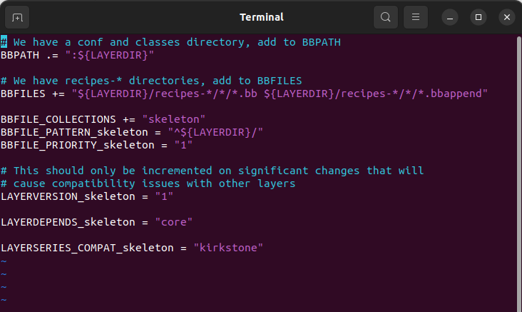

## Variable Assignment

**1. Basic Variable Setting**

The following example sets `VARIABLE` to "value". This assignment occurs immediately as the statement is parsed. It is a "hard" assignment.

```
plaintext
VARIABLE = "value"
```

As expected, if you include leading or trailing spaces as part of an assignment, the spaces are retained:

```
plaintext
VARIABLE = " value"
VARIABLE = "value "
```

Setting `VARIABLE` to "" sets it to an empty string, while setting the variable to " " sets it to a blank space (i.e., these are not the same values).

```
plaintext
VARIABLE = ""
VARIABLE = " "
```

You can use single quotes instead of double quotes when setting a variable's value. Doing so allows you to use values that contain the double quote character:

```
plaintext
VARIABLE = 'I have a " in my value'
```

**2. Variable Expansion**

Variables can reference the contents of other variables using a syntax that is similar to variable expansion in Bourne shells. The following assignments result in `A` containing "aval" and `B` evaluating to "preavalpost".

```
plaintext
A = "aval"
B = "pre${A}post"
```

**3. Setting a Default Value (?=)**

You can use the "?=" operator to achieve a "softer" assignment for a variable. This type of assignment allows you to define a variable if it is undefined when the statement is parsed, but to leave the value alone if the variable has a value. Here is an example:

```
plaintext
A ?= "aval"
```

If `A` is set at the time this statement is parsed, the variable retains its value. However, if `A` is not set, the variable is set to "aval".

**4. Setting a Weak Default Value (??=)**

It is possible to use a "weaker" assignment than in the previous section by using the "??=" operator. This assignment behaves identical to "?=" except that the assignment is made at the end of the parsing process rather than immediately. Consequently, when multiple "??=" assignments exist, the last one is used. Also, any "=" or "?=" assignment will override the value set with "??=". Here is an example:

```
plaintext
A ??= "somevalue"
A ??= "someothervalue"
```

If `A` is set before the above statements are parsed, the variable retains its value. If `A` is not set, the variable is set to "someothervalue".

**5. Immediate Variable Expansion (:=)**

The ":=" operator results in a variable's contents being expanded immediately, rather than when the variable is actually used:

```
plaintext
T = "123"
A := "${B} ${A} test ${T}"
T = "456"
B = "${T} bval"
C = "cval"
C := "${C}append"
```

In this example, `A` contains "test 123" because ${B} and ${A} at the time of parsing are undefined, which leaves "test 123". And, the variable `C` contains "cvalappend" since ${C} immediately expands to "cval".

**6. Appending (+=) and Prepending (=+) With Spaces**

Appending and prepending values is common and can be accomplished using the "+=" and "=+" operators. These operators insert a space between the current value and prepended or appended value.

These operators take immediate effect during parsing. Here are some examples:

```
plaintext
B = "bval"
B += "additionaldata"
C = "cval"
C =+ "test"
```

The variable `B` contains "bval additionaldata" and `C` contains "test cval".

**7. Appending (.=) and Prepending (=.) Without Spaces**

If you want to append or prepend values without an inserted space, use the ".=" and "=." operators.

These operators take immediate effect during parsing. Here are some examples:

```
plaintext
B = "bval"
B .= "additionaldata"
C = "cval"
C =. "test"
```

The variable `B` contains "bvaladditionaldata" and `C` contains "testcval".

**8. Appending and Prepending (Override Style Syntax)**

You can also append and prepend a variable's value using an override style syntax. When you use this syntax, no spaces are inserted.

These operators differ from the ":=", ".=", "=.", "+=", and "=+" operators in that their effects are deferred until after parsing completes rather than being immediately applied. Here are some examples:

```
plaintext
B = "bval"
B_append = " additional data"
C = "cval"
C_prepend = "additional data "
D = "dval"
D_append = "additional data"
```

The variable `B` becomes "bval additional data" and `C` becomes "additional data cval". The variable `D` becomes "dvaladditional data".

**9. Removal (Override Style Syntax)**

You can remove values from lists using the removal override style syntax. Specifying a value for removal causes all occurrences of that value to be removed from the variable.

When you use this syntax, BitBake expects one or more strings. Surrounding spaces are removed as well. Here is an example:

```
plaintext
FOO = "123 456 789 123456 123 456 123 456"
FOO_remove = "123"
FOO_remove = "456"
FOO2 = "abc def ghi abcdef abc def abc def"
FOO2_remove = "abc def"
```

The variable `FOO` becomes "789 123456" and `FOO2` becomes "ghi abcdef".

Like "_append" and "_prepend", "_remove" is deferred until after parsing completes.


Variables are either local or global. 

**Local** values reside in **recipes**, while **global** variables reside in **configuration** files.


## Bitbake commands

Note: always run bitbake from build directory!

1) ### Local variables

   `bitbake -e recipe | grep variable`

   > **-e revipe** extracts recipe variables
   >
   > **grep variable** greps on the variable name

2) ### Global variables

   `bitbake -getvar variable`

3. ### Recipes

   `bitbake recipe`

   if you face an error: **can't find recipe**, it's because you have to add your absolute layer path to the **BBLAYER** variable inside **bblayer.conf**

   **Solution 1:**

   `vim BBLAYER.conf`

   add your layer

   **Solution 2:** 

   `bitbake-layer add-layer absolutepath`

4. ### Layers

   - **For help:**

     `bitbake-layers --help`

   - **To create new layer:**

     `bitbake-layers add-layer abolutepath`

     **example:**

     `bitbake-layers add-layer /home/fady/yocto/meta-itilayer`
     
   - To show layers
   
     bitbake-layers show-layers 
   
     `cat conf/bblayers.conf | grep BBLAYERS`


## Configuration Files

> /yocto/poky/build/conf 
>
> ├── bblayers.conf
> ├── local.conf
> └── templateconf.cfg
>
> 

### 1) bblayers.conf


### 2) local.conf

has an **IMAGE_INSTALL **variable that takes recipes of binaries you want included in your rootfs.

**Example:** `IMAGE_INSTALL=calculator`

`bitbake calculator` will output your binaries

`bitbake core-image-minimal` will compile all recipes and install the binaries in the rootfs if their recipes are in `IMAGE_INSTALL`.

**Append to variable:**

1) IMAGE_INSTALL= "calculator git dropbear"

2) +=/=+/append/preappend assignment operator

### 3) **layer.conf**

Each layer in the Yocto Project has its own `layer.conf` file. This file is used to configure the layer and to provide information to BitBake about the layer's contents and structure.



```
BBPATH .= ":${LAYERDIR}"
```

This line appends the value of `${LAYERDIR}` to the `BBPATH` variable localed in **bblayers.conf**. 

The `${LAYERDIR}` variable represents the path to the current layer. 

The `.` before the `=` operator means that the value is appended to the existing value of `BBPATH`. without spaces.

 The `:` is used as a separator between different paths in `BBPATH`.

```
BBFILES += "${LAYERDIR}/recipes-*/*/*.bb ${LAYERDIR}/recipes-*/*/*.bbappend"
```

 The `+=` operator means that the value is appended to the existing value of `BBFILES` with spaces.

 `${LAYERDIR}` is again the path to the current layer. 

The pattern `"${LAYERDIR}/recipes-*/*/*.bb"` matches all `.bb` files in any directory within the `recipes-*` directory structure within `${LAYERDIR}`. 

Similarly, `"${LAYERDIR}/recipes-*/*/*.bbappend"` matches all `.bbappend` files in the same directory structure.


## wic file format

The Yocto Project's Image Creator tool (wic) is used to create disk **images** that can be written directly to a physical device, such as an SD card or a USB drive, or used as disk images for virtual machines. These disk images typically contain a complete operating system image, including the kernel, root filesystem, and any additional software components specified in the Yocto Project build configuration.

The `.wic` file format is essentially a compressed disk image that includes all the necessary components to boot and run the target system. It is often used in embedded Linux development to deploy custom Linux distributions to target devices.

To use a `.wic` file, you would typically write it to a storage device using a tool like `dd` on Unix-like systems or Win32 Disk Imager on Windows, or you could use it as the basis for a virtual machine image in a hypervisor like QEMU or VirtualBox.

**Example on using dd command with .wic image:**

`sudo dd if=image.wic of=/dev/sdX bs=4M status=progress`

> Replace `image.wic` with the path to your `.wic` file, and replace `/dev/sdX` with the device path of your storage device.


## Recipe Configuration 

### Components

```
SUMMARY = "Example Recipe"
LICENSE = "MIT"

SRC_URI = "https://example.com/archive.tar.gz"

S = "${WORKDIR}/archive"

do_configure()
{
    # Configuration commands go here
}

do_compile() {
    # Compilation commands go here
}

do_install() {
    # Installation commands go here
}
```

1. **Source URI (`SRC_URI`)**: This variable  specifies the source location from which the source code will be  fetched. It can be a URL, a local file path, or any other valid URI.

2. **Source directory (`S`)**: This variable specifies the directory where the source code will be extracted and built. It's typically set to `${WORKDIR}/<source_directory_name>`.

> 1. **Download Directory (`DL_DIR`)**:
>    - The download directory is where the source code archives and files specified by the `SRC_URI` variable are downloaded and stored.
>    - This directory is specified by the `DL_DIR` variable in the `conf/local.conf` or `conf/site.conf` configuration files.
>    - The `DL_DIR` directory is typically located outside of the build directory to allow for caching and sharing of downloaded source code between different builds.
>    - The Yocto Project caches downloaded source code in this directory to avoid repeatedly downloading the same source code during subsequent builds.
>    - By default, the `DL_DIR` directory is located within the `tmp` directory of the build directory (`TMPDIR`), but it can be customized to point to a different location if needed.
> 2. **Source Directory (`S`)**:
>    - The source directory is where the source code archives downloaded from the download directory are **unpacked** **(using tar)** and built.
>    - This directory is specified by the `S` variable in each individual recipe's `.bb` or `.bbappend` file.
>    - The source directory typically contains the source code files, patches, and any other resources needed to build the software.
>    - The Yocto Project extracts the downloaded source code archives into this directory before starting the build process.
>    - Each recipe has its own source directory, and multiple recipes can have their source code extracted and built simultaneously in different source directories within the build environment.
>
> 3. **Packages**: Individual binary packages generated during the build process are stored in subdirectories such as `tmp/deploy/ipk` (for IPK packages), `tmp/deploy/rpm` (for RPM packages), or `tmp/deploy/deb` (for Debian packages)


3. **do_configure:**

- **Description:** `do_configure` is a phase in the recipe or build process of a software project where the project's configuration is prepared and set up. This phase typically involves actions such as setting compilation flags, resolving dependencies, and configuring options specific to the target system.
- **In a Recipe:** In a recipe, such as those used in build systems like Yocto or OpenEmbedded, `do_configure` is a designated function or task where the necessary steps for configuring the software are defined. This could involve running a configure script, setting environment variables, or manipulating configuration files.
- **Example:** In a recipe for building a C++ application, the `do_configure` task might involve running the `./configure` script with specific options to enable or disable certain features based on the target platform or user preferences.

4. **do_compile():**

- **Description:** `do_compile` is a phase in the recipe or build process where the source code of the software is translated into machine code or otherwise prepared for execution. This phase typically involves compiling source files into object files, linking object files into executable binaries or libraries, and performing other necessary compilation steps.
- **In a Recipe:** In a recipe, `do_compile()` is a designated function or task where the compilation process for the software is defined. This could involve invoking a compiler (e.g., GCC for C/C++), assembling code (for assembly language programs), or executing other build tools necessary for compiling the software.
- **Example:** In a recipe for building a Python package from its source code, the `do_compile()` task might involve running `python setup.py build` to compile Python source files into bytecode or to build any C extensions included in the package.

5. do_install():**

- **Description:** `do_install` is a phase in the recipe or build process where the compiled or built artifacts of the software are installed onto the target system. This phase typically involves copying files, setting permissions, and performing other necessary tasks to make the software accessible and usable on the target system.

- **In a Recipe:** In a recipe, `do_install()` is a designated function or task where the installation process for the software is defined. This could involve copying compiled binaries or libraries to their destination directories, installing configuration files, creating symbolic links, and performing other installation-related tasks.

- **Example:** In a recipe for building and installing a command-line tool, the `do_install()` task might involve copying the compiled executable binary to a system-wide binary directory (e.g., `/usr/local/bin`), along with any associated documentation or configuration files needed for the tool to function correctly.

  

## Calculator Application Recipe

```
SUMMARY="Simple Calculator Program"
LICENSE="MIT"
LIC_FILES_CHKSUM = "file:////home/yasmin/yocto/meta-itilayer/COPYING.MIT;md5=3da9cfbcb788c80a0384361b4de20420"

FILESEXTRAPATHS:prepend := "${THISDIR}/CalcRecipe:"

SRC_URI="file://calculator.c \
	 file://Makefile" 

S ="${WORKDIR}"

do_compile(){
    	make 
}
```


## References:

1) https://docs.yoctoproject.org/2.2/bitbake-user-manual/bitbake-user-manual.html#setting-a-default-value