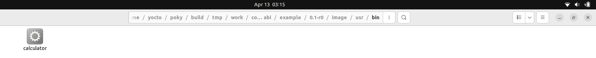

# YOCTO Lecture 3


## 1) Running Recipe on QEMU


### 1.1) Creating a Layer

```
source oe-init-build-env

bitbake-layers add-layer /home/yasmin/yocto/poky/meta-test

bitbake show-layers
```


### 1.2) Creating a Recipe

```
DESCRIPTION = "Caluclator Recipe"

LICENSE = "MIT"
LIC_FILES_CHKSUM = "file://${COMMON_LICENSE_DIR}/MIT;md5=0835ade698e0bcf8506ecda2f7b4f302"

FILESEXTRAPATHS:prepend := "/home/yasmin/ELTasks/CalcRecipe:" 

SRC_URI="file://calculator.c"

S="${WORKDIR}"

do_compile(){
${CC} ${CFLAGS} ${LDFLAGS} calculator.c -o calculator
}

do_install(){
install -d ${D}${bindir}
install -m 0755 calculator ${D}${bindir}
}
```


> 1) **Description**: Simple Description about your Recipe
> 2) **LICENSE**: Each software package included in the Yocto Project typically has an  associated license that governs how it can be used, distributed, and  modified.
> 3) **LIC_FILES_CHKSUM**: The "license_checksum" field, on the other hand, is a checksum of the  license text itself. It's used as a form of validation to ensure that  the license text specified in the recipe matches the actual license text provided by the software's upstream source. This helps ensure that  you're accurately representing the licensing terms of the software  you're distributing.
> 4) **FILESEXTRAPATHS**: Any path added to this variable allows the recipe to see files inside it by using file://<file.c>.


> **To get your license checksum:**
>
> `bitbake-getvar COMMON_LICENSE_DIR`
>
> 
>
> Navigate to the path and write: `md5sum MIT` to get your checksum


**To view your 'S' directory:**

`bitbake -e example | grep S=`


**Appending to "IMAGE INTSALL" Variable:**


> Note:
>
> For DUNFELL: IMAGE_INSTALL_append = " example"
>
> for KIRKSTONE: IMAGE_INSTALL:append= " example"


**Viewing Image Install Variable:**

`bitbake-getvar IMAGE_INSTALL`


**Viewing the Binary on the Image SYSROOT:**

`bitbake -e example | grep D=`




### 1.3) Building the Image:

`bitbake core-image-minimal`


### 1.4) Running Image on QEMU:

`runqemu core-image-minimal`


## 2) To be continued..