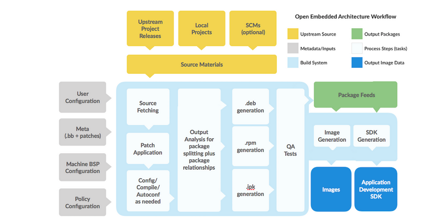
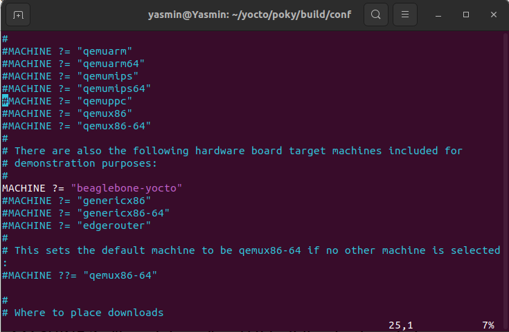
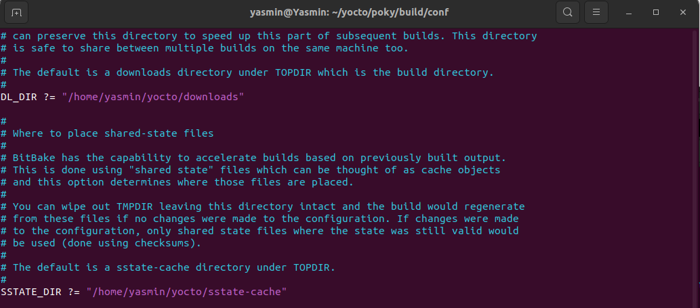

# The Yocto Project


## Yocto Introduction

The Yocto Project (YP) is an open source collaboration project that  helps developers create custom Linux-based systems regardless of the  hardware architecture. The project provides a flexible set of tools,  definitions and configurations (called stacks), and steps to build a  customized Linux images.        

Historically the project grew from, and works with the OpenEmbedded Project which is the build system the project uses and shares components with.

The Yocto Project combines and maintains several key elements:

1. The OpenEmbedded build system, co-maintained with the OpenEmbedded Project consisting of OpenEmbedded-Core and BitBake.
2. A reference/example embedded Linux configuration used for testing (called Poky)
3. Extensive testing infrastructure through our Buildbot based autobuilder
4. Integrated tools to make working with embedded Linux successful:
   - tools for automated building and testing
   - processes and standards for board support definitions and interchange
   - tools security analysis and license compliance, software manifests (SBoM) support in SPDX

There are many different open source components and tools within the Yocto Project umbrella.

Poky, the reference embedded OS is actually a working BUILD EXAMPLE  which will build a small embedded OS with the included build system  (BitBake, the build engine and OpenEmbedded-Core, the core build system  metadata).

The build system is downloaded with Poky build instruction “files”  called recipes and layers (defined below). You can alter, copy, extend,  or use the Poky build specifics in any way you might need to in order to create your custom embedded Linux.

**Input**

Set of data that describes what we want, that is our specification,  including Kernel Configuration, Hardware Name, Packages/Binaries to be  installed

**Output**

Linux Based Embedded Product, such as Linux Kernel, Root File System, Bootloader, Device Tree, Toolchain

**Advantages of Yocto Project**:

1. Widely Adopted Across the Industry: 

2. Support multiple architectures: from Intel, ARM, MIPS, PPC, etc.,  Chip vendors create and supply BSPs that support their hardware

3. Images and Code Transfer Easily: just update configuration, and keep all other stacks

4. Flexibility: Through customization and layering, a project group can  leverage the base Linux distribution to create a distribution that works for their product needs.

   

## Yocto Terminologies

1) **Metadata**

   A key element of the Yocto Project is the  meta-data which is used to construct a Linux distribution, contained in  the files that the build system parses when building an image. In  general, Metadata includes recipes, configuration files and other  information referring to the build instructions themselves, as well as  the data used to control what things get built and to affect how they  are built. The meta-data also includes commands and data used to  indicate what versions of software are used, and where they are obtained from, as well as changes or additions to the software itself (patches  or auxiliary files) which are used to fix bugs or customize the software for use in a particular situation. OpenEmbedded Core is an important  set of validated metadata.

   Metadata is collection of:

   - Recipes (.bb and .bbappend)
   - Configuration files (.conf)
   - Classes (.bbclass)
   - Includes (.inc)

2. **Recipes**

   They contain instructions on how to fetch, compile, and install software components into your Linux distribution.

   Extension: **`.bb`**

   A recipe describes:

   - where you get source code
   - which patches to apply
   - Configuration options
   - Compile options (library dependencies)
   - Install
   - License

3. **Configuration Files**

   They tell the build system what to build and put into the image to support a particular platform

   Extension: **`.conf`**
    **Files which hold**:

   - global definition of variables
   - user defined variables and
   - hardware configuration information


    **Types**:

   - Machine Configuration Options
   - Distribution Configuration Options
   - Compiler tuning options
   - General Common Configuration Options
   - User Configuration Options (local.conf)

4. **Layers**

   A collection of related recipes. Typical naming convention: `meta-<layername>`.

   Layers provide a mechanism to isolate metadata according to functionality, for instance BSPs, distribution configuration, etc.

   `BBLAYERS` variable present in `build/conf/bblayers.conf` file list the layers Bitbake tries to find.

   If `bblayers.conf` is not present when you start the build, the OpenEmbedded build system creates it from `bblayers.conf.sample` when you source the `oe-init-build-env` script.

5. **Packages**

   A package is a binary file with name *.rpm,* .deb, or *.ipkg. A  single recipe may produce many packages. All packages that a recipe  generated are listed in the recipe variable.


## Other Terminologies

### **Poky**

- Role: Poky is a reference distribution within the Yocto Project. It provides a pre-configured and pre-built Linux distribution that serves as a starting point for customizations.

- Integration: Poky integrates with the Yocto Project by leveraging its tools and methodologies. It includes metadata, configuration files, and recipes necessary to build a basic Linux distribution. Developers can use Poky as a foundation and customize it to meet their specific requirements by adding or removing software components, adjusting configurations, and so on. Poky serves as an example of how to use the Yocto Project tools to create custom Linux distributions.

  

### OpenEmbedded

[OpenEmbedded](http://www.openembedded.org/wiki/Main_Page)  allows developers  to create a complete Linux Distribution for embedded systems.

The Yocto Project and OpenEmbedded share a core collection of metadata called OpenEmbedded-Core(`oe-core`).

- The Yocto Project focuses on providing powerful, easy-to-use,  interoperable, well-tested tools, metadata, and board support packages  (BSPs) for a core set of architectures and specific boards.

- OpenEmbedded is a build framework for creating embedded Linux  distributions. It provides tools, metadata, and recipes to build custom  Linux distributions for embedded devices. BitBake is the build engine  used by OpenEmbedded to execute tasks defined in the metadata and  recipes

  

### **OpenEmbedded-Core**: 

oe-core is meta-data composed of  foundation recipes, classes and associated files that are meant to be  common among many different OpenEmbedded-derived systems, including the  Yocto Project. It is a curated subset of an original repository  developed by the OpenEmbedded community which has been pared down into a smaller, core set of continuously validated recipes resulting in a  tightly controlled and a quality-assured core set of recipes. 


You might wonder, why use Yocto instead of OpenEmbedded directly to generate an Embedded Linux image?

> Using OpenEmbedded directly to generate an embedded Linux image is certainly an option, especially for experienced developers familiar with its intricacies. However, the Yocto Project offers several advantages that may make it a more appealing choice for many developers:
>
> 1. **Standardization and Best Practices**: The Yocto Project provides standardized tools, methodologies, and best practices for building embedded Linux distributions. This standardization makes it easier for developers to adopt a consistent workflow and ensures compatibility across projects.
> 2. **Modularity and Layering**: The Yocto Project introduces the concept of layers, allowing developers to modularize their project and manage customizations more effectively. Layers provide a structured way to organize metadata, configuration files, and recipes, making it easier to maintain and share code across projects.
> 3. **Community Support and Ecosystem**: The Yocto Project has a large and active community of developers, contributors, and users. This community-driven ecosystem provides support, documentation, tutorials, and training materials to help developers get started and overcome challenges.
> 4. **Tooling and Automation**: The Yocto Project extends BitBake with additional features and enhancements to streamline the build process. It includes tools for dependency management, incremental builds, performance optimizations, and task automation, improving productivity and efficiency.
> 5. **Flexibility and Customization**: While OpenEmbedded provides a powerful build framework, the Yocto Project builds upon it to offer additional flexibility and customization options. Developers can use the Yocto Project to create custom Linux distributions tailored to their specific requirements, with fine-grained control over software components, configurations, and optimizations

You can use `tree pocky -L 1`to see the Poky tree:

```
pocky
├── bitbake
├── contrib
├── documentation
├── LICENSE
├── LICENSE.GPL-2.0-only
├── LICENSE.MIT
├── MEMORIAM
├── meta
├── meta-poky
├── meta-selftest
├── meta-skeleton
├── meta-yocto-bsp
├── oe-init-build-env
├── README.hardware -> meta-yocto-bsp/README.hardware
├── README.OE-Core
├── README.poky -> meta-poky/README.poky
├── README.qemu
└── scripts
```

Poky provides you a script `oe-init-build-env`, which should be used to set up the build environment. 

You can pass a `build_directory` argument for the name of the directory where the environment is set. In case it is not given, it defaults to `build`.

The above script will move you in a build folder and create two files (`local.conf`, `bblayers.conf`) inside `conf` folder. The defaults are set to build for a `qemux86-64`.


## Configuration Files

```
conf
├── bblayers.conf
├── local.conf
└── templateconf.cfg
```

### **1) local.conf:**

Contains local user settings for almost aspects of the build system,

1. `MACHINE`: **The target machine** is being built for.

   E.g.: `MACHINE = "qemux86-64"`


2. `IMAGE_FSTYPES`: **Output image formats** are list of different image formats.

   These images can be used for different purpose, such as rootfs, raw disk, MTD partition.
    E.g.: `IMAGE_FSTYPES += "tar.bz2 jffs2 wic"`


3. `CORE_IMAGE_EXTRA_INSTALL` **add extra packages to an image**

   This is a convenience variable that enables you to add extra packages to an image based on the `core-image` class.
    E.g.: `CORE_IMAGE_EXTRA_INSTALL += "openssh"`

   - `IMAGE_INSTALL`: This is the variable that controls what is included in any image. Use `IMAGE_INSTALL_append` only!\

     E.g.: `IMAGE_INSTALL_append = " openssh"` note the space  Use `IMAGE_INSTALL +=` will override the `CORE_IMAGE_EXTRA_INSTALL` that can lead to missing packages.


4. `DL_DIR`: **Where to place downloads**

   During a first build the system will download many source code  tarballs, from various upstream projects. These are all stored in `DL_DIR`. The default is a `downloads` directory under `TOPDIR` which is the build directory.

   This download folder can be shared between builds. It also can create tarball files using `BB_GENERATE_MIRROR_TARBALLS = "1"` option. You can also pre-fetch source code without running any compilation with `--runonly=fetch` option in bitbake.

   Example to create sharing downloaded package folder:

   ```
   DL_DIR ?= "${HOME}/yocto-downloads"
   bitbake <target> --runonly=fetch
   ```

   

5. `TMP_DIR`: **Where to place the build output**

   This option specifies where the bulk of the building work should be  done and where Bitbake should place its temporary files(source  extraction, compilation) and output.

   `BB_NUMBER_THREADS`: **Determine the number of tasks** that Bitbake will perform **in parallel**

   Note: These tasks are related to bitbake and nothing related to compiling. Defaults to the number of CPUs on the system.


6. `PARALLEL_MAKE`: **Specify the number of processes** that GNU make can run **in parallel**

   This specifies the number of processes that GNU make can run in  parallel on a compilation task. Defaults to the number of CPUs on the  system. Corresponds to the `-j` make option.


### 2) **bblayers.conf:**

The `bblayers.conf` file tells Bitbake what layers you want considered during the build.

By default, the layers listed in this file include layers minimally needed by the build system. However, you must manually add any custom layers you have created.

```
BBLAYERS = "\
    /home/vqtrong/poky/meta \
    /home/vqtrong/poky/meta-poky \
    /home/vqtrong/poky/meta-yocto-bsp \
    "
```

To add/remove a layer, you can use `bitbake-layers` command, for example:

```
bitbake-layers add-layer ../meta-openembedded/meta-oe
```

To show all layers:

```
bitbake-layers show-layers
```


## Generated Images

**Top-level image targets**:

There are some top-level image targets defined for different purposes, such as:

- `core-image-minimal`: A small image just capable of allowing a device to boot.
- `core-image-base`: A console-only image that fully supports the target device hardware.
- `core-image-sato`: An image with Sato support, a mobile  environment and visual style that works well with mobile devices. The  image supports X11 with a Sato theme and applications such as a  terminal, editor, file manager, media player, and so forth.
- `core-image-weston`: A very basic Wayland image with a  terminal. This image provides the Wayland protocol libraries and the  reference Weston compositor.
- `core-image-x11`: A very basic X11 image with a terminal.

**Component images**:

The build process writes component images out to the Build Directory inside the `tmp/deploy/images/machine/` folder:

- `kernel-image`: A kernel binary file.
      The `KERNEL_IMAGETYPE` variable determines the naming scheme for the kernel image file.
- `root-filesystem-image`: Root filesystem for the target device (e.g. *.ext3 or* .bz2 files).
      The `IMAGE_FSTYPES` variable determines the root filesystem image type
- `kernel-modules`: Tarballs that contain all the modules built for the kernel.
- `bootloaders`: If applicable to the target machine, bootloaders supporting the image.


 **Image formats**:

Yocto can generate different image formats, e.g.

- `tar` file: extract into formatted partition
- partition image (e.g. `ext4`, `jffs2`): raw copy to disk or MTD partition
- disk image (wic): raw copy to disk


## Workflow of Yocto Project




### 1) BitBake Function Blocks:

a) **User Configuration**: This includes the metadata for managing the YOCTO build process. As a developer, you can define the build environment by specifying target architecture, location to store the downloaded source, and other build properties using User Configuration file.

b) **Metadata, Machine & Policy Configuration Layers:** These layers consist of data critical for the management of the build process.

- Metadata: This layer consists of user-supplied recipe files, patches, and append files.
- Machine Configuration (BSP): This layer consists of information specific to your target architecture for which the image is being built, such as kernel configuration, bootloader settings, device tree files,  and any additional software packages or configurations specific to that  hardware.
- Distro Layer/Policy Configuration: This layer consists of data that specifies the policy configurations for the specific distribution. This layer includes class files, configuration files and recipes. These recipes would include custom image recipes, distribution-specific configuration, initialization scripts.

c) **Source Files**: These include sources such as Upstream releases, local projects, and Source Control Manager (SCMs), from where the build system downloads source files to build an image.

d) **Build System**: This block specifies the processes during which  the BitBake fetches source, applies patches, executes compilation, analyzes output for package generation, generates and tests these packages, generates images and cross- development tools.

e) **Package Feeds**: This module consists of directories with various types of output packages in RPM, DEB or IPK format. Package feeds are used while building an image or SDK, produced by the build system. They are also used for extending or updating existing images on devices at runtime by copying and sharing them on web server.

f) **Images**: This is an output module that manages the Linux Images created by the Build System.

g) **Application Development SDK**: The module consists of various cross-development tools, which are built either along with the image or separately with BitBake.


### 2) BitBake Build Steps

**Step 1:** First, the developer has to decide the  various high-level configurations like what machine the image is to be  built for, any special configuration data needed for the build, types of images to be built, etc.

**Step 2:** Once the configuration is ready, next comes the source code. The source code can be in the form of tarballs, fetched  from project releases or from Git or SVN or even be locally added to the workspace. 

**Step 3:** Often, there may be a need to apply patches to  the source code to tailor the software component to the desired machine  or this specific image. These patches are applied next.

**Step 4:** What do you do with source code? You build!  That indeed is the next step. Most common build tools like autotools,  cmake, etc. are supported. Bitbake takes care of doing the necessary  configuration and compilation.

**Step 5:** The outputs of this build process are then  placed into a temporary staging area where the packaging is done like  .deb, .rpm, .ipk, etc. This packaging info is one of the configurations  specified at the very beginning before we obtained the source code. 

Different Linux distributions have their own packaging standards and tools. For example, Debian-based distributions use `.deb` packages managed by tools like `dpkg` and `apt`, while Red Hat-based distributions use `.rpm` packages managed by tools like `rpm`, `yum`, or `dnf`.

**Step 6:** QA activities happen throughout the process – especially during the BitBake engine’s operation.

> Here's what the QA Test Layer typically includes:
>
> 1) **Test Cases**: The layer contains a collection of test cases covering various aspects of the system, including functionality, performance, and reliability. These test cases help ensure that the Linux distribution meets the required standards and behaves as expected.
>
> 2. **Test Frameworks**: It integrates with test frameworks such as Autotest, LTP (Linux Test Project), and others to automate the execution of test cases. These frameworks provide tools and infrastructure for running tests across different target platforms and configurations
>
> 3. **Integration with BitBake**: The QA Test Layer integrates seamlessly with the BitBake build system  used in OpenEmbedded and Yocto Project. This allows users to easily  include QA tests as part of their build process and incorporate test  results into the overall build workflow

**Step 7:** Once the binary packages are ready, all that is necessary is to create a package feed that is suitable for the image  that is requested.

**Step 8:** This package feed culminates with  the creation of the final image! Easy-peasy! By the way, a linux image  is not all that the build process can create. The build process can also optionally be used to generate an SDK that can be used to develop and  build applications for the machine that is running the very image you  generate and load on that machine. This is extremely handy and takes  away tons of complications that may result from not using a tailored SDK – especially in a diverse team of developers!


## Steps to Generate a Yocto Image

```
mkdir yocto
cd yocto
git clone -b dunfell https://github.com/yoctoproject/poky.git
cd poky
source oe-init-build-env
cd conf
vim local.conf
```

We will change some configurations in the local.conf file:

1) **Change machine from qemux86-64 to beaglebone-yocto**



When you set the MACHINE variable to "beaglebone-yocto" in your  local.conf file within a Yocto Project setup, Yocto will include the  necessary layer(s) that contain recipes, metadata, and configurations  specifically tailored for the BeagleBone platform.

2) **Change directories of downloads & shared-state files**



Now you can start building your image: 
`$bitbake -k core-image-minimal`


References:

1) https://www.yoctoproject.org/development/technical-overview/
2) https://kickstartembedded.com/2021/12/19/yocto-part-1-a-definitive-introduction/?amp=1
3) https://www.codeinsideout.com/blog/yocto/introduction/#prerequisites
4) https://sternumiot.com/iot-blog/yocto-project-components-use-cases-and-a-quick-tutorial/
