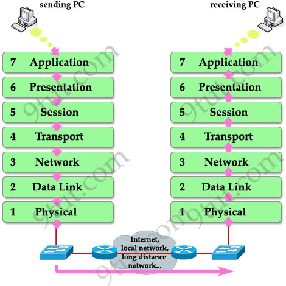

# Embedded Linux Task : Using TFTP Protocol for U-boot/ Z-Image/DTB File Transferring


## Understanding TFTP




For any 2 computers or servers to share information with one another, they must follow this layered model called the "OSI Model". Each computer must have a network interface (NIC) in order to communicate. The model is explained briefly in the picture below:


As shown in the application layer, we have many protocols we can use based on what exactly we want to transfer. (HTTPS, TFTP, SMTP....)

In our Task, we will use the TFTP protocol for file transfer. The transfer will be done using either TCP or UDP Protocol. Both protocols can transfer the files, but the UDP protocols is faster and less reliable than TCP, which suits file transfer. 

TCP and UDP transfers data using PORTS to differentiate between different data we want to send. You can imagine a port to a header. The header will tell the other computer whether the data being sent is Web Browser Data (HTTPS), Email (SMTP), or a File (TFTP) and so on...   

Both TCP and UDP share the same port number space (ranging from 0 to 65535), a port number for a specific service or application can be assigned to either TCP, UDP, or both, depending on the requirements of that service.

> Here are some common port assignments for TCP and UDP:
>
> **Common TCP Port Numbers:**
>
> - HTTP (Hypertext Transfer Protocol): 80
> - HTTPS (HTTP Secure): 443
> - FTP (File Transfer Protocol): 21
> - SSH (Secure Shell): 22
> - Telnet: 23
> - SMTP (Simple Mail Transfer Protocol): 25
> - POP3 (Post Office Protocol version 3): 110
> - IMAP (Internet Message Access Protocol): 143
>
> **Common UDP Port Numbers:**
>
> - DNS (Domain Name System): 53
> - DHCP (Dynamic Host Configuration Protocol): 67, 68
> - TFTP (Trivial File Transfer Protocol): 69
> - SNMP (Simple Network Management Protocol): 161, 162

In the last task, we initialized our U-BOOT via a  SD-CARD. The next step would be to add our zimage and dtb file to the boot partition in the SD-CARD as well. However, that would need space, so what if I dont have enough budget to buy a larger SD-CARD? 

So in this Task, we will store our z-image and dtb file onto a file on our computer that is transfered to our Beaglebone or QEMU Emulator using the TFTP Protocol. We can also use it to replace our current U-BOOT or MLO.

First, we need to install the TFTP Package on our Ubunto. 

## Installing TFTP Package

`sudo apt-get install tftpd-hpa`

We will need our computers IP address, and the beaglebone's IP address in order for the 2 devices to see each other.

You might wonder, does this mean that our beaglebone can access my entire computer? No. 

After we installed the TFTP package, a configuration file called tftpd-hpa was created in /etc/default.


If we open it, we will see that the TFTP Protocol has access to only the directory /srv/tftp.


## Changing Ownership of /srv/tftp

If we navigate to /srv/tftp, we will notice that the owndership of the tftp directory is **root:root**. We wan to change the ownership of this directory to be to TFTP only to enhance security. So we will use:

```
cd /srv
chown tftp:tftp tftp 
```

 

## Create dummy files inside /srv/tftp

Since we still haven't developed our kernel, we dont have our zimage and dtb files yet, so we will create dummy files called  **zimage** and **hw.dtb**, and write dummy text in them.

```
cd /srv/tftp
touch zimage
open zimage
```

Write dummy text: This is the zimage kernel!

```
touch hw.dtb
open hw.dtb
```

Write dummy text: This is the HW dtb!

## Set up Server (Computer) IP Address

First, we need to know our computer's ip address through:

`ip addr`


We can see that we have 2 IP Addresses 

1) Loopback IP Address
2) Your machine's IP Address: 192.168.1.11/24

We will set up a TAP Interface between our PC and QEMU. Lets understand whats a TAP interface:

>  **TAP Interface:**
>
>    +--------------------------+
>    |      Your Computer       |
>    |                          |
>    |   +------------------+   |
>    |   | Physical NIC     |   |
>    |   | MAC: 01:23:45:67:89:AB |
>    |   | IP: 192.168.1.2   |   |
>    |   +------------------+   |
>    |            |             |
>    |   +------------------+   |
>    |   |      TAP Interface  |   |
>    |   |   Virtual NIC    |   |
>    |   |   MAC: 12:34:56:78:CD:EF |  |
>    |   |   IP: 192.168.1.2  |   |
>    |   +------------------+   |
>    +--------------------------+
>               |
>    +--------------------------+
>    |       QEMU (Virtual Machine)  |
>    |                          |
>    |   +------------------+   |
>    |   | Virtual NIC      |   |
>    |   | MAC: 23:45:67:89:EF:01 | |
>    |   | IP: 192.168.1.4  |   |
>    |   +------------------+   |
>    +--------------------------+
>
> - TAP interfaces are used in scenarios where you want the virtual machine  to be integrated into the local network as if it were a physical  machine. It allows the VM to communicate with other devices on the same network.
>
> - When you use a TAP interface, the virtual machine becomes part of the same local network as the host machine.
>
> - TAP is a virtual network interface that facilitates  communication between software entities, such as virtual machines (VMs)  or containers, and the physical network.
>
>   
>
>   Let's break down why you might use a TAP (network tap) interface in the context of QEMU and virtualization, using simpler terms:
>
>   1. **Network Connectivity:**
>      - When you run a virtual machine (VM) using QEMU, it's like having a separate computer within your computer. However, for this virtual machine to communicate with your physical computer and the rest of your home or office network, you need a way to connect them.
>   2. **TAP Interface as a Bridge:**
>      - The TAP interface acts like a virtual network cable or bridge. It connects the virtual machine to your local network, making it part of the same network as your physical computer. This allows the VM to talk to other devices on your network.
>   3. **Seamless Integration:**
>      - Without a TAP interface, the VM might be like a computer in isolation, unable to easily communicate with other devices on your network. The TAP interface makes the VM seamlessly integrated into your local network, just like any other device connected to your router.
>   4. **File Sharing and Networking:**
>      - If you want to share files between your physical computer and the virtual machine or if you need the VM to access the internet, the TAP interface makes these things possible. It's like giving the virtual machine its own connection to your home or office network.
>   5. **Example Use Case - TFTP:**
>      - If you're using TFTP to transfer files between your computer and the virtual machine, the TAP interface facilitates this communication. The VM can send TFTP requests to your computer over the TAP interface, and your computer responds, allowing file transfers.
>
>   The TAP interface provides network connectivity to the virtual machine.  QEMU will use this interface to communicate with other devices on the  local network, including your host machine.

Now we understood the reason for using a TAP interface, lets set it up using a script

```
touch qemu_ifup
open qemu_ifup
```


When the virtual machine communicates with the network, it sends packets through the TAP interface. The TAP interface acts like a **bridge**, forwarding these packets between the virtual machine and the host machine. We want out TAP interface to have an IP address in the **s****ame network/subnet** as our host machine, so will will give it an ip address of 192.168.165.220.

The line `ip a add 192.168.165.220 dev $1` assings the TAP Interface IP address 

The line `ip link set $1 up` sets up the TAP interface IP address

We need to give the script execute permission using

`chmod +x qemu-ifup`

## Set IP address for the U-Boot environment

`sudo qemu-system-arm -M vexpress-a9 -m 128M -nographic -kernel ~/NEW_SD/mnt/boot/u-boot -sd ~/NEW_SD/sd.img -net tap,script=./qemu_ifup -net nic`

`-net tap:` Sets up a TAP network interface 

`-net nic:`  Sets up a network interface for QEMU. 


> Here are some commonly used environment variables related to networking in U-Boot:
>
> 1. **`ipaddr`:**
>    - Stores the IP address for the device. You can set this variable to configure the IP address for network communication.
>
> `setenv ipaddr <YourIPAddress>` (SAME NETWORK AS SERVER)
>
> 2. **`serverip`:**
>
> - Stores the IP address of the server (e.g., TFTP server) from which U-Boot can load files.
>
> `setenv serverip <ServerIPAddress>` 

In my U-BOOT I entered:

```
setenv ipaddr 192.168.165.223	//QEMU IP Address (Same Network)
setenv serverip 192.168.165.222 //HOST IP ADDRESS 
saveenv
```

**Note:** The TAP interface will use the QEMU IP Address to send the data to the HOST IP address through its IP Address configured in the script.


## Uploading files through TFTP

Now I want to send the zimage and dtb files through the TFTP server to my DRAM. 

First I need to know where my DRAM begins, so I will use `bdinfo`, which states that my DRAM begins at 0x60000000.

`tftp 0x60000000 zimage`   

Use the command `md 0x60000000` to see the contents of your DRAM!


The same thing is done for the hw.dtb file. Choose an available memory so it doesn't overlap on the kernel.

`tftp 0x60000020 hw.dtb`   


## Enhancing Readability

To be continued ...